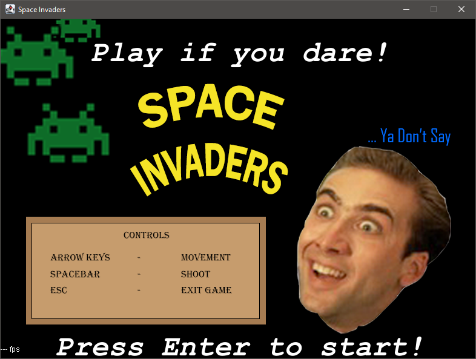
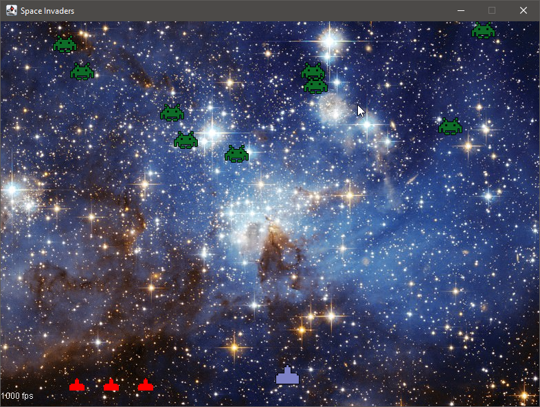
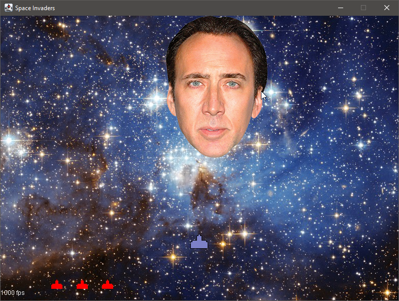
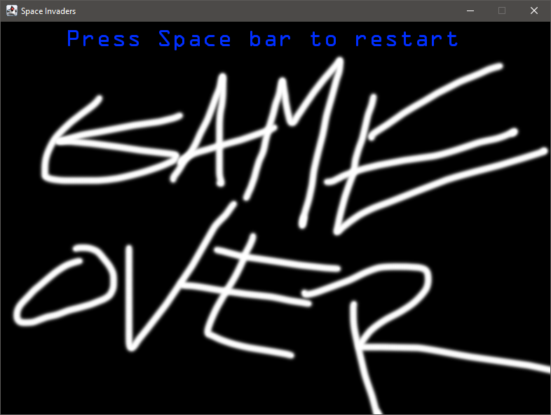

# A Space invaders clone with... a cage.
This game was one of my initial development projects consisting of using the core java-libraries in order to create a space invaders clone / remix.

This was apart of my initial programming module which gave me my initial experience with working in a team for the development of a project.

## Sample Screenshots

